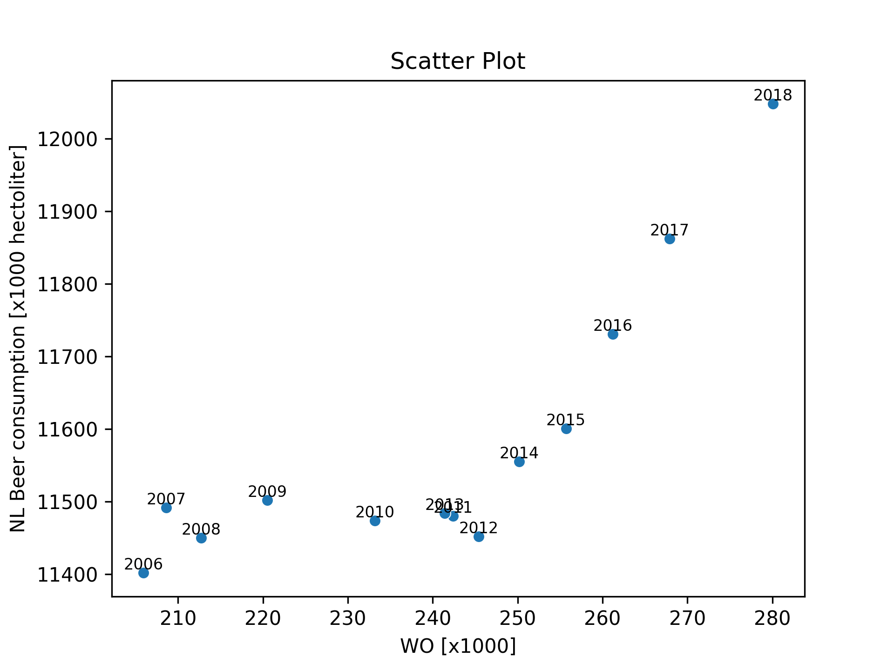

## Papers
1. Fantastic yeasts and where to find them: the hidden diversity of dimorphic fungal pathogens

Van Dyke, M. C. C., Teixeira, M. M., & Barker, B. M. (2019). Fantastic yeasts and where to find them: the hidden diversity of dimorphic fungal pathogens. Current opinion in microbiology, 52, 55-63.

2. An analysis of the forces required to drag sheep over various surfaces

Harvey, J. T., Culvenor, J., Payne, W., Cowley, S., Lawrance, M., Stuart, D., & Williams, R. (2002). An analysis of the forces required to drag sheep over various surfaces. Applied ergonomics, 33(6), 523-531.

3. Correlation of continuous cardiac output measured by a pulmonary artery catheter versus impedance cardiography in ventilated patients

Ziegler, D. W., Lois, M., Hess, D., Pinilla, J., & Tellez, G. (2005). Correlation of continuous cardiac output measured by a pulmonary artery catheter versus impedance cardiography in ventilated patients. Chest, 128(4), 194S.

## Plot
Scatter Plot with Pearson Correlation

*Figure 1: Scatter plot showing the relationship between "WO [x1000]" and "NL Beer consumption [x1000 hectoliter]" for different years. 
The blue dots represent individual data points, each labeled with the corresponding year. The Pearson Correlation Coefficient is 0.8180643555130895.*

The graph shows that across the years, the correlation between WO and NL Beer consumption, measured by the Pearson coefficient increases. This suggests a positive linear relationship between these two variables. As WO increases, NL Beer consumption tends to increase as well. 

The code is available at: https://github.com/shreyaraghavendra/CS_Assignment/blob/main/Assignment-GitHub.ipynb
