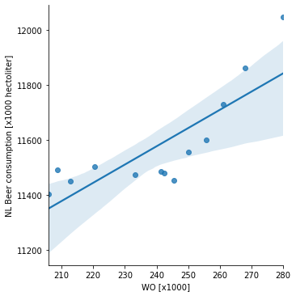

# Computational Scientist's Toolbox Assignment

Van Dyke MCC, Teixeira MM, Barker BM. Fantastic yeasts and where to find them: the hidden diversity of dimorphic fungal pathogens.

J.T Harvey, J Culvenor, W Payne, S Cowley, M Lawrance, D Stuart, R Williams,

An analysis of the forces required to drag sheep over various surfaces, Applied Ergonomics, Zeigler DW, Wang CC, Yoast RA, Dickinson BD, McCaffree MA, Robinowitz CB, Sterling ML; Council on Scientific Affairs, American Medical Association. The neurocognitive effects of alcohol on adolescents and college students.

The plot presented above suggests that there is a corelation between those variables. This can be verified statisticly with pearsonr function in scipy, the pearson coefficient is equal to 0.82 and p-value is approximately 6*10^-4, therepfre we can assume that there is a correlation based on those results. Of course, correlation does not imply causality. 