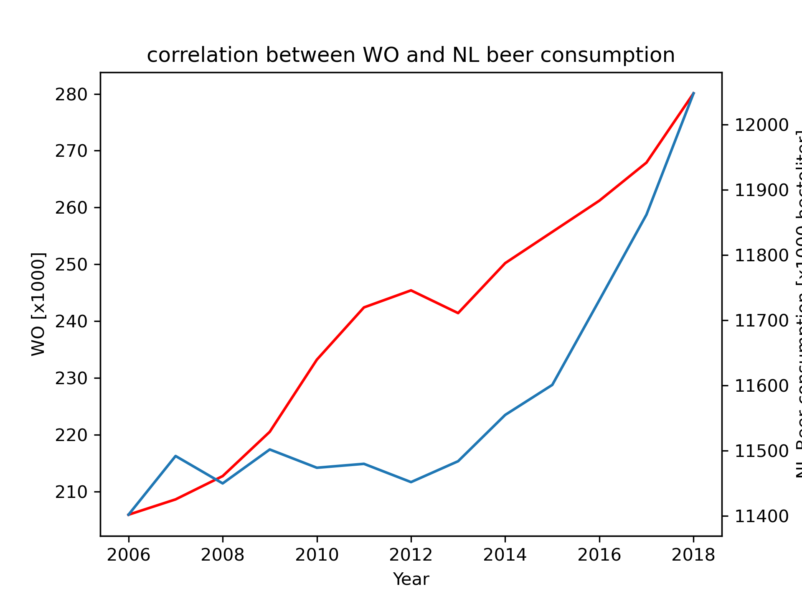

MCC Van Dyke at al., 2019: Fantastic yeasts and where to find them: the hidden diversity of dimorphic fungal pathogens

JT Harvey, Appliad Ergonomics, 2002: An analysis of the forces required to drag sheep over various surfaces

DW Ziegler et al., 2005: Correlation of continuous cardiac output measured by a pulmonary artery catheter versus impedance cardiography in ventilated patients

