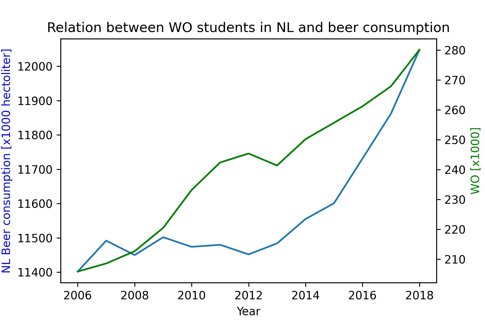

# Title of papers
* Fantastic yeasts and where to find them: the hidden diversity of dimorphic fungal pathogens AND The Rise of Coccidioides: Forces Against the Dust Devil Unleashed
* An analysis of the forces required to drag sheep over various surfaces
* The neurocognitive effects of alcohol on adolescents and college students

# Plot

It seems there is a correlation but that does not mean there is a causation. It is probably related to the overal population size increasing, which means the number of WO students, as well as the total amount of beer consumption increases.
