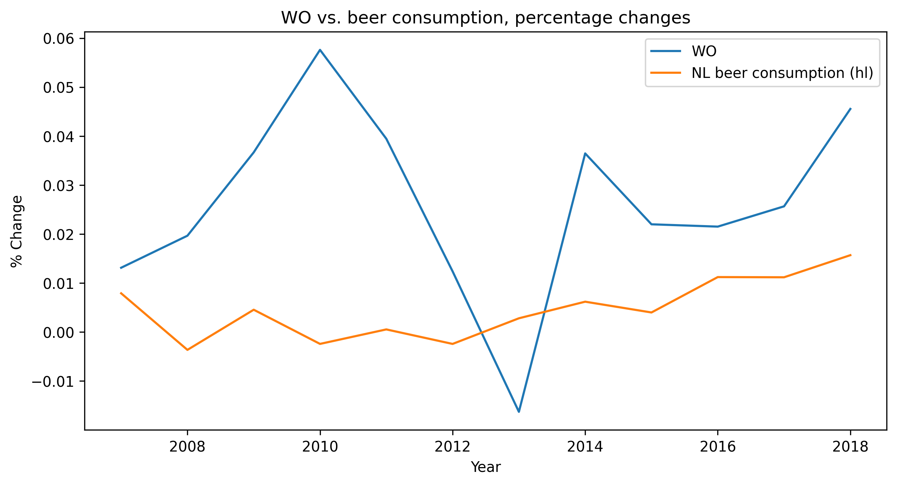

# Solution to CS_Assignment

_student ID:_ 14073145

Papers:  
- MCC Van Dyke et al., 2019: The Rise of Coccidioides: Forces Against the Dust Devil Unleashed / Fantastic yeasts and where to find them: the hidden diversity of dimorphic fungal pathogens 
- JT Harvey, Applied Ergonomics, 2002: An analysis of the forces required to drag sheep over various surfaces
- DW Ziegler et al., 2005: Correlation of continuous cardiac output measured by a pulmonary artery catheter versus impedance cardiography in ventilated patients

The plot displays annual percentage changes for the WO variable and the Netherlands beer consumption in hectoliters. The trend in the two scaled variables seems to be similar; however, too few data points are provided to assert that there exist some relations between the two time series. It is also possible to denote a higher standard deviation in the WO variable compared to the NL beer consumption standard deviation. 