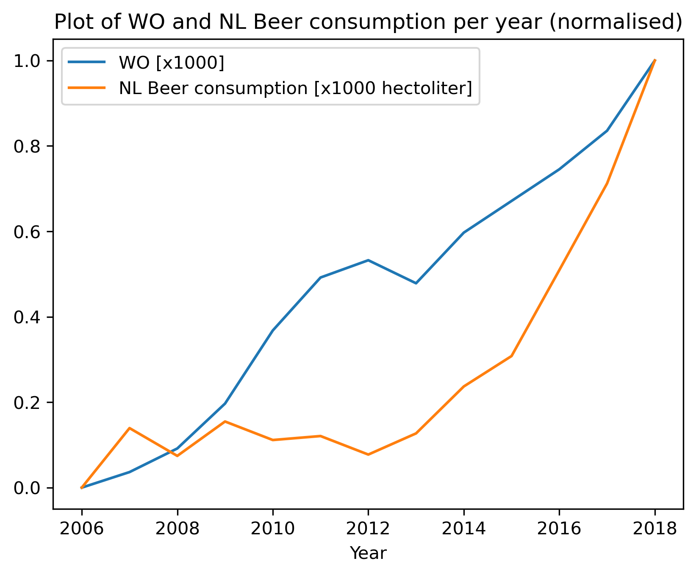

# Titles of the papers
1. Fantastic yeasts and where to find them: the hidden diversity of dimorphic fungal pathogens
2. An analysis of the forces required to drag sheep over various surfaces
3. The neurocognitive effects of alcohol on adolescents and college students

# Plot of WO and NL Beer consumption

Above we see a plot of the normalised values of WO and beer consumption in the Netherlands in hectoliters over the years 2006 to 2018. The data for WO and beer consumption is strongly correlated, as can be seen by the general upwards trend. This fact is further backed up by a Pearson correlation coefficient of 0.818.