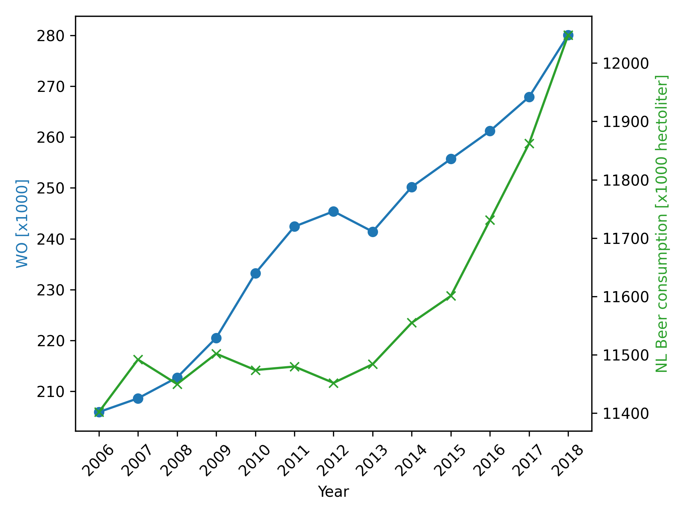

Student ID: 12016926
Student name: Frederieke Loth

1. Fantastic yeasts and where to find them: the hidden diversity of dimorphic fungal pathogens by MCC Van Dyke et al., 2019
2. An analysis of the forces required to drag sheep over various surfaces by JT Harvey, Applied Ergonomics, 2002
3. The neurocognitive effects of alcohol on adolescents and college students
 by DW Ziegler et al., 2005

 

 The data as shown in the plot attempts to show a correlation between the alcohol consumption and number of students in The Netherlands. Even if one were to neglect fluctuations in the correlation, this data may very well be circumstancial. It would likely be more effective if there was data available on alcohol consumption of specific age groups/ stores. Such as those in proximity to universities.