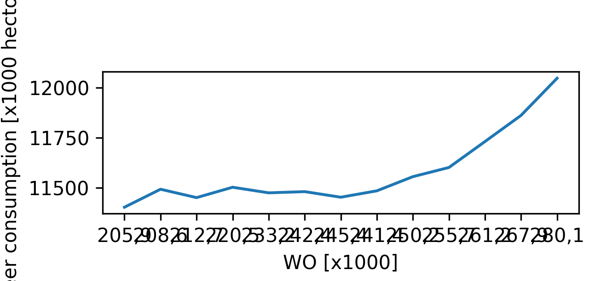

## Titles of the papers given that are pivotal to our knowledge:

1) Fantastic yeasts and where to find them: the hidden diversity of dimorphic fungal pathogens 
2) An analysis of the forces required to drag sheep over various surfaces
3) Correlation of continuous cardiac output measured by a pulmonary artery catheter versus impedance cardiography in ventilated patients

This plot shows correlations between the amount of WO students and beer consumption.
