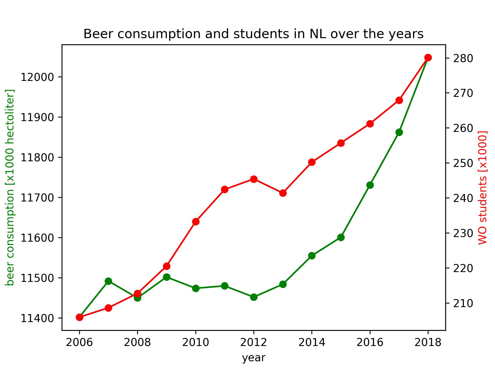

# Academic skills assignment - Nina van der Meulen - 12896934

**paper titles**
- "Fantastic yeasts and where to find them: the hidden diversity of dimorphic fungal pathogens" - MCC Van Dyke et al., 2019
- "An analysis of the forces required to drag sheep over various surfaces" - JT Harvey, Applied Ergonomics, 2002
- "The neurocognitive effects of alcohol on adolescents and college students" - DW Ziegler et al., 2005

**beer consumption plot**

Beer consumption in NL was fairly constant until about 2012, since then it has majorly increased. We can not be sure if this is entirely due to the increase in students, since the drastic increase in number of students already started 3 years before the rise in beer consumption, but there does seem to be some type of correlation in the years after 2012.