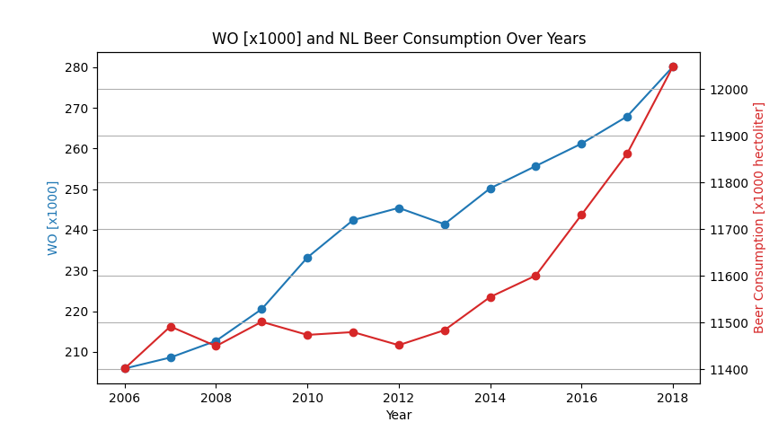
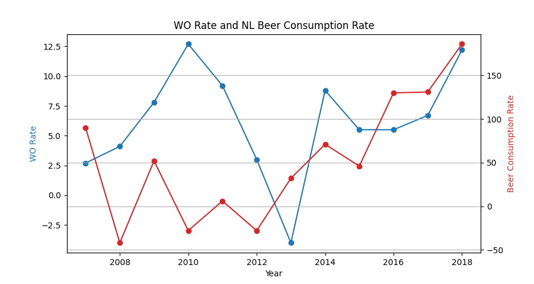
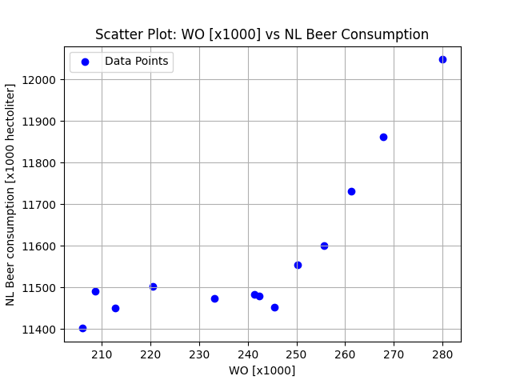

# Computational Scientist's Toolbox Assignment

---

Peterson, Victoria J  
*ID: 15476758* 

University of Amsterdam  
*Academic Skills: Computational Science, Block 1, 2024*  

Due: 25 September 2024  

---

### Pivotal Knowledge
- MCC Van Dyke et al., 2019
- JT Harvey, Applied Ergonomics, 2002
- DW Ziegler et al., 2005

---

### University Education vs Beer Consumption
#### Interpretation of Data
With the assumption that _WO_ stands for "Wetenschappelijk Onderwijs", i.e. students in University Education, a qualitative interpretation of the data from 2006 to 2018 can be made using the data visualizations above. 

Even without best-fit lines to fit our two sets of data in figure 1, we can see general increase in both participants in university education and in beer consumption. With a qualitative eye, we may also see a slight negative correlation in datasets between the years of 2009 to 2013, but looking at figure 2, we see that a rate correlation is difficult to observe beyond the generally upward trend seen in figure 1. Furthermore, plotting both datasets against one-another gives us a good idea of these correlations by giving us a generally positive correlative trend without any considerable negative correlative trend.

Ultimately, it is difficult to make any true hypotheses about the relationship between data without further quantitative analysis.

#### Figures

Figure 1

Figure 2

Figure 3