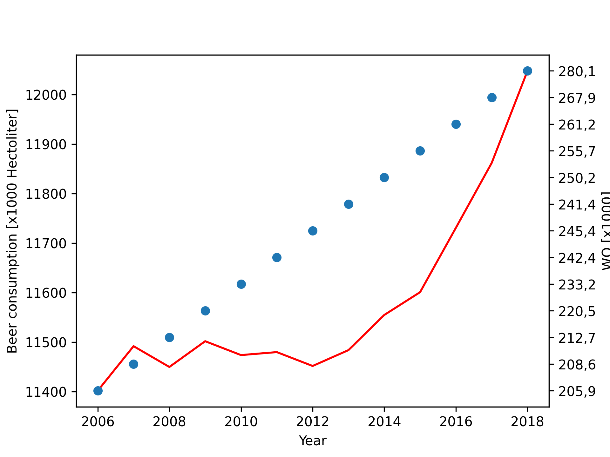

Name: L.M. Pahladsingh
Studentnumber: 13846566

1. Titles of papers

MCC Van Dyke et al., 2019L: Fantastic yeasts and where to find them: the hidden diversity of dimorphic fungal pathogens

JT Harvey, Applied Ergonomics, 2002: An analysis of the forces required to drag sheep over various surfaces

DW Ziegler et al., 2005: The neurocognitive effects of alcohol on adolescents and college students

2. Plot 

Interpretation: there is an exponential growth in beer consumption over the years. There seems to also be an increase in WO students per year. However, more research needs to be done to study whether there is a correlation between beer consumption and education. 
