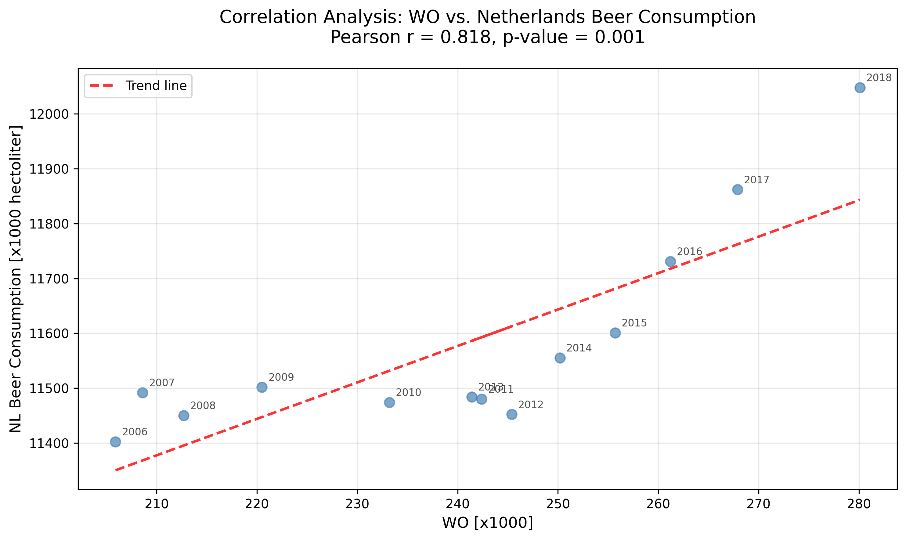

# Computational Scientist's Toolbox Assignment
**Student ID:** 13089951

## Pivotal Papers

The following papers are pivotal to our knowledge in the field:

1. **MCC Van Dyke et al., 2019**
2. **JT Harvey, Applied Ergonomics, 2002**
3. **DW Ziegler et al., 2005**

### Dataset Overview
More people means more pints!

