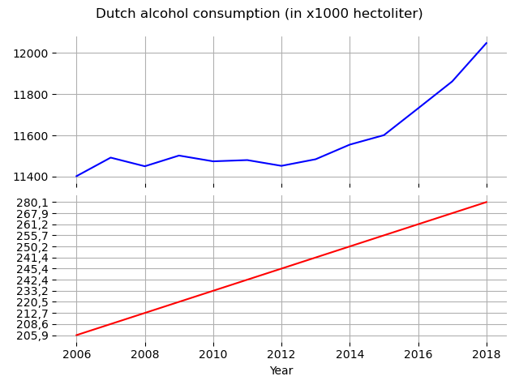

# Our key papers
*They are pivotal to our knowledge*

- [MCC Van Dyke et al., 2019](https://doi.org/10.1016/j.mib.2019.05.002)
- [JT Harvey, Applied Ergonomics, 2002](https://doi.org/10.1016/S0003-6870(02)00071-6)
- [DW Ziegler et al., 2005](https://doi.org/10.1378/chest.128.4_MeetingAbstracts.194S-a)

# Plot
Here is a plot based on a [CSV file](istherecorrelation.csv) from this repository:


## Comment
While it is true that W0 increases linearly with the years while beer consumption fluctuates, it is clear that the overall trend is positive. It is also worth noting that W0 and beer consumption values are an order of magnitude apart.

## Code
This is the code used for the [plot](istherecorrelation.csv_plot.png):
```python
"""
Creates a simple plot out of a CSV file
"""
import pandas as pd
import matplotlib.pyplot as plt


file = "istherecorrelation.csv"
df   = pd.read_csv(file,sep=';')

years             = df.iloc[:, 0]
other_consumption = df.iloc[:,1]
beer_consumption  = df.iloc[:,2]

fig, (ax1,ax2) = plt.subplots(nrows=2, sharex=True, subplot_kw=dict(frameon=False)) # frameon=False removes frames
plt.subplots_adjust(hspace=.0)
ax1.grid()
ax2.grid()
ax1.plot(years, beer_consumption, color='b', linestyle='-')
ax2.plot(years, other_consumption, color='r')

plt.suptitle('Dutch alcohol consumption (in x1000 hectoliter)')
plt.xlabel('Year')
plt.tight_layout()
plt.rcParams['figure.dpi'] = 300
plt.show()
```
