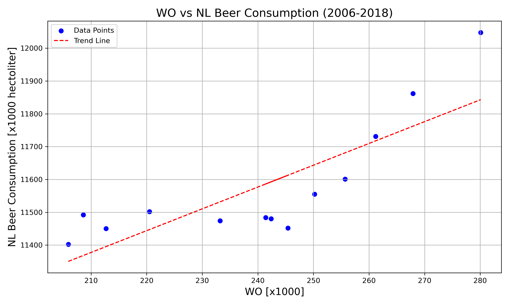

# Solution

## Student ID
12247014

## Papers Title
1. **MCC Van Dyke et al., 2019**: *Fantastic yeasts and where to find 
them: the hidden diversity of dimorphic fungal pathogens*
2. **JT Harvey, Applied Ergonomics, 2002**: *An analysis of the forces 
required to drag sheep over various surfaces*
3. **DW Ziegler et al., 2005**: *The neurocognitive effects of alcohol on 
adolescents and college students*

## Correlation Plot

### Interpretation of the Data
The plot above illustrates the relationship between Doctorate degrees and 
NL Beer consumption [x1000 hectoliter] over the years 2006 to 2018. As 
observed there is a general upward trend in both metrics, indicating an 
increase in beer consumption alongside the growth in the WO figures.
