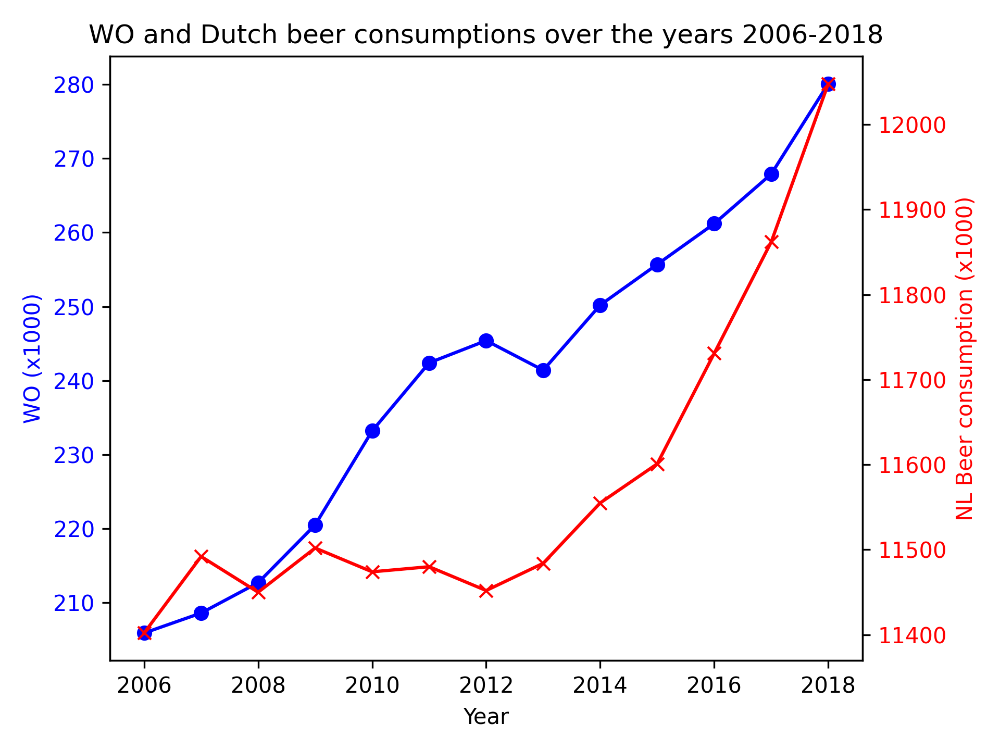

1. Fantastic yeasts and where to find them: the hidden diversity of dimoprhic fungal pathogens. By MCC Van Dyke et al., 2019
2. An analysis of the forces required to drag sheep over various surfaces. By JT Harvey, Applied Ergonomics, 2002
3. The neurocognitive effects of alcohol on adolescents and college students. By DW Ziegler et al., 2005

The plot shows no significant correlation between WO and NL Beer consumption in the years 2006 to 2018. This becomes clear when adding two y-axes to the plot.