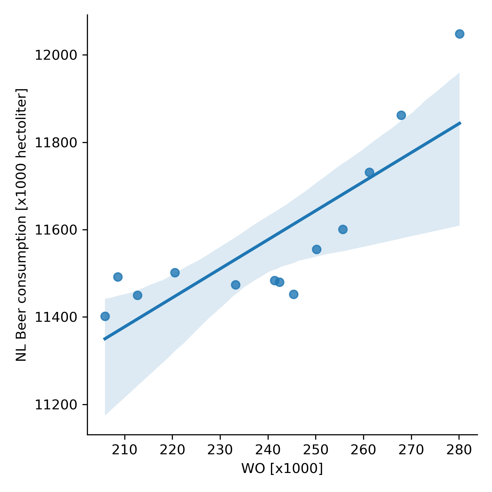

# Paper titles
The title of the papers are:
1. The rise of Coccidioides: forces against the dust devil unleashed.
2. An analysis of the forces required to drag sheep over various surfaces
3. The neurocognitive effects of alcohol on adolescents and college students

# Correlation plot

We can see from this plot that (in general) as the amount of university students goes up, the total amount of beer consumption in the Netherlands goes up as well. 
