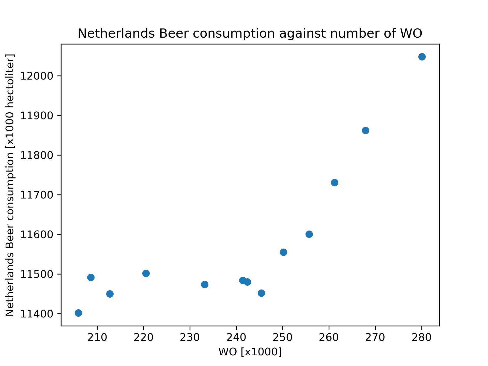

student: Lisa Pijpers

studentID: 15746704

MCC Van Dyke et al., 2019: Fantastic yeasts and where to find them: the hidden diversity of dimorphic fungal pathogens

JT Harvey, Applied Ergonomics, 2002: An analysis of the forces required to drag sheep over various surfaces

DW Ziegler et al., 2005: The neurocognitive effects of alcohol on adolescents and college students

Interpretation: There is some correlation between the two variables (beer consumption and WO). We can observe that for most years both variables increase. An exception is the period between the years 2010 and 2013 when the values of beer consumption do not increase but remain stable.
