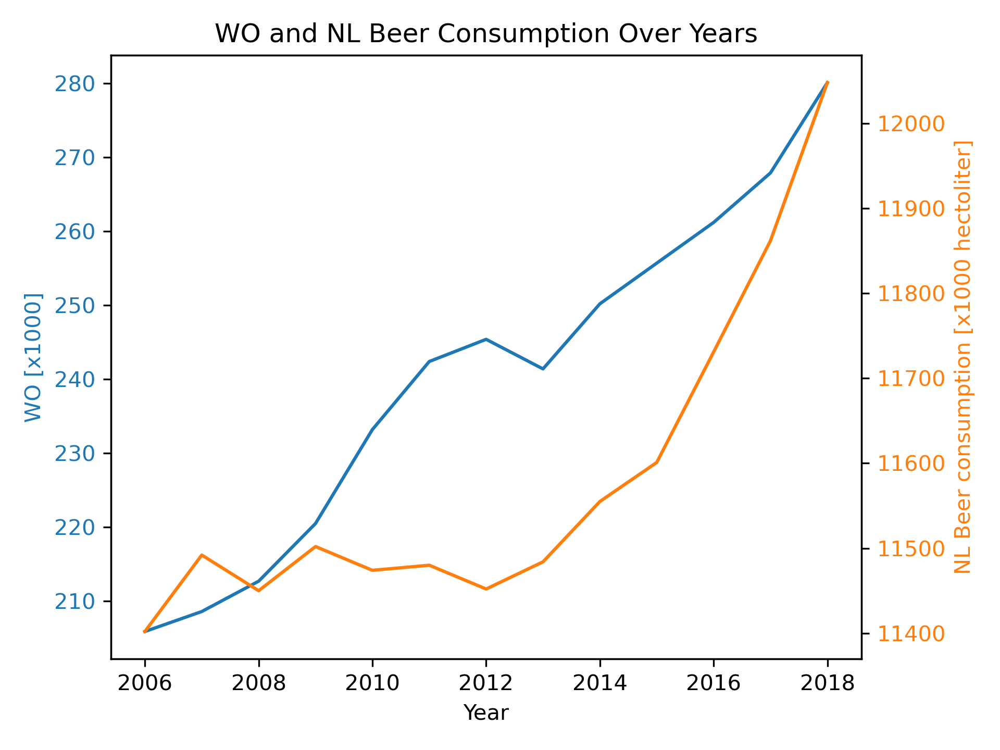

# Academic Skills Assignment

## Student Information
**Student Name:** [Xiaoxuan Zhang]  
**Student ID:** [15390802]  

---

## The following papers are pivotal to our knowledge in this assignment:

- **MCC Van Dyke et al., 2019**
- **JT Harvey, Applied Ergonomics, 2002**
- **DW Ziegler et al., 2005**

---

## Data Visualization

The plot below is generated from the dataset `istherecorrelation.csv` with a DPI setting of 300.

### Plot:

### Data Interpretation

The plotted data shows two trends over the years from 2006 to 2018: the **WO [x1000]** values (academic higher education numbers in the Netherlands) and **NL Beer consumption** (in x1000 hectoliters). 

1. **WO Trend**: There is a clear upward trend in the WO values, indicating a steady increase in the number of students engaged in academic higher education. The growth becomes more pronounced after 2010, showing a consistent rise in the number of students reaching nearly 280,000 in 2018.
   
2. **Beer Consumption Trend**: The beer consumption values exhibit smaller fluctuations, with a relatively stable consumption rate between 11,400 and 12,000 thousand hectoliters. However, from 2014 onwards, beer consumption steadily increases, reaching over 12,000 thousand hectoliters in 2018.

3. **Comparison**: While both trends show growth, the rate of increase in the **WO** values is more significant than that of beer consumption. This may suggest that although the number of students in higher education has increased, it does not directly correlate to a proportional increase in beer consumption.
