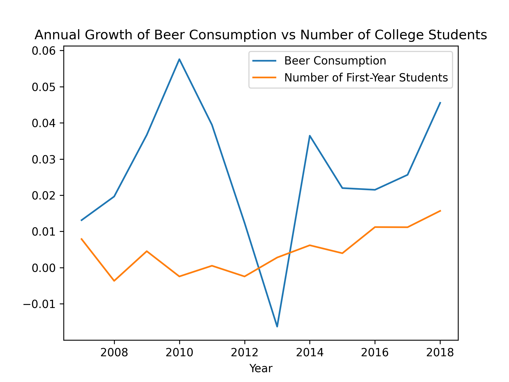

## Student ID
16390288

## Papers
- MCC Van Dyke et al., 2019
- JT Harvey, Applied Ergonomics, 2002
- DW Ziegler et al., 2005

## Visualization
Here is the plot I created from the dataset **istherecorrelation.csv**:

## Interpretation
The graph shows that both WO and beer consumption in the Netherlands have increased over the years, 
with the normalized comparison suggesting a potential positive correlation between the two trends. 
While correlation does not imply causation, the data highlights how the two variables evolve similarly.
