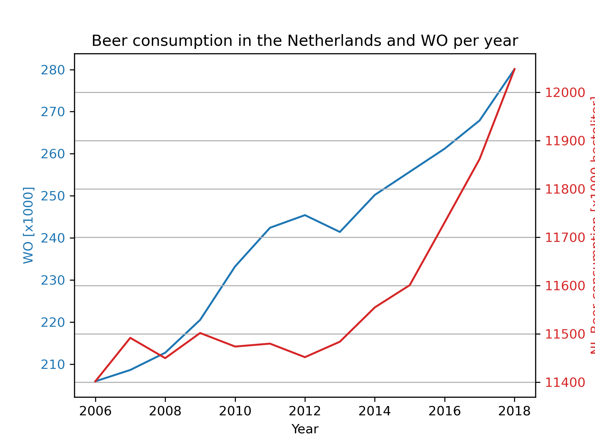

<h1>CLS Academic Skills</h1>

Assignment L3: Tools for Computational Scientists

Rénan van Dijk 12150746

<h2>Names of the papers:</h2>

- MCC Van Dyke et al., 2019
    - Fantastic yeasts and where to find them: the hidden diversity of dimorphic fungal pathogens
- JT Harvey, Applied Ergonomics, 2002
    - An analysis of the forces required to drag sheep over various surfaces
- DW Ziegler et al., 2005
    - The neurocognitive effects of alcohol on adolescents and college students  (note: this paper is written by DW Zeigler et al., since I cannot find any other fitting paper for DW Ziegler et al., 2005, I assume that Ziegler is a typo.)

<h2>Plot of the data:</h2>

From the plot we see that there appears to be a correlation between WO and beer consumption in the Netherlands. Unfortunately, since it is unclear what WO means, we cannot speculate about the meaning of this correlation.