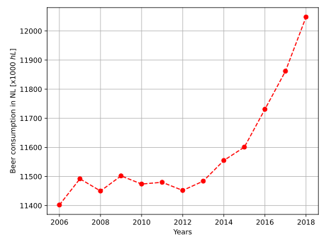

# Computational Scientist's Toolbox Assignment

Made by Amish Sewlal \
Studentnumber: 13297503

## Titles of papers:
Reference: MCC Van Dyke et al., 2019\
Titles: 
1. Fantastic yeasts and where to find them: the hidden diversity of dimorphic fungal pathogens
2. The Rise of Coccidioides: Forces Against the Dust Devil Unleashed

Reference: JT Harvey, Applied Ergonomics, 2002\
Title:
1. An analysis of the forces required to drag sheep over various surfaces
   
Reference: DW Ziegler et al., 2005\
Title:
1. The neurocognitive effects of alcohol on adolescents and college students

# Plot from dataset and interpretation:
 \
Between 2006 and 2012 the consumption seemed to be stable within 100 x 1000 hL beer consumption, but started to increase after 2012. This could imply that the years after 2012 and the beer consumption are **correlated**, but the increasing years does not have to be the **cause** of the increase in consumption.