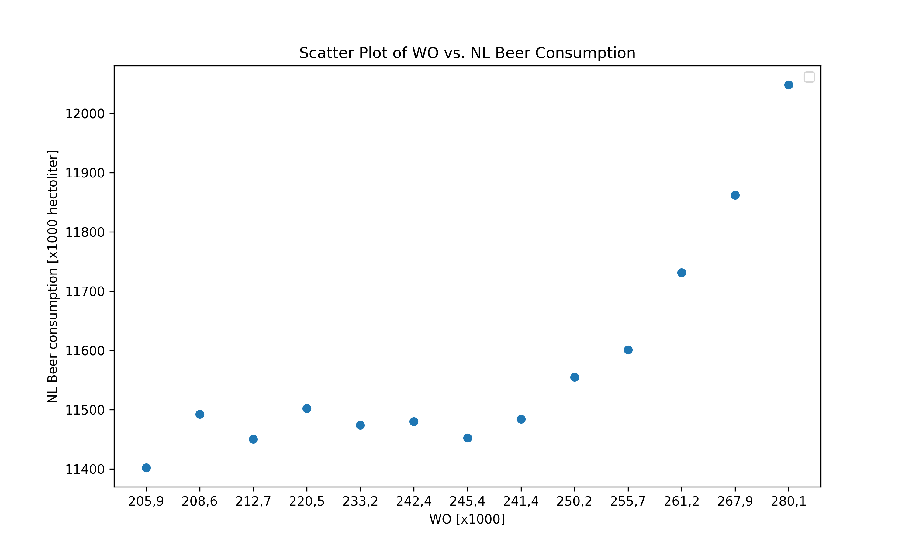

# Computational Scientist's Toolbox Assignment 

## The title of the following papers pivotal to our knowledge:
* MCC Van Dyke et al., 2019
Fantastic yeasts and where to find them: the hidden diversity of dimorphic fungal pathogens
* JT Harvey, Applied Ergonomics, 2002
An analysis of the forces required to drag sheep over various surfaces.
* DW Ziegler et al., 2005
The neurocognitive effects of alcohol on adolescents and college students

## Plot from the dataset "istherecorrelation.csv", with DPI=300. 

### Plot interpretation 
The scatter plot shows the relationship between 'WO [x1000]' and 'NL Beer consumption [x1000 hectoliter]'.
There is no clear linear correlation between these two variables, as the points are scattered without a clear trend.
