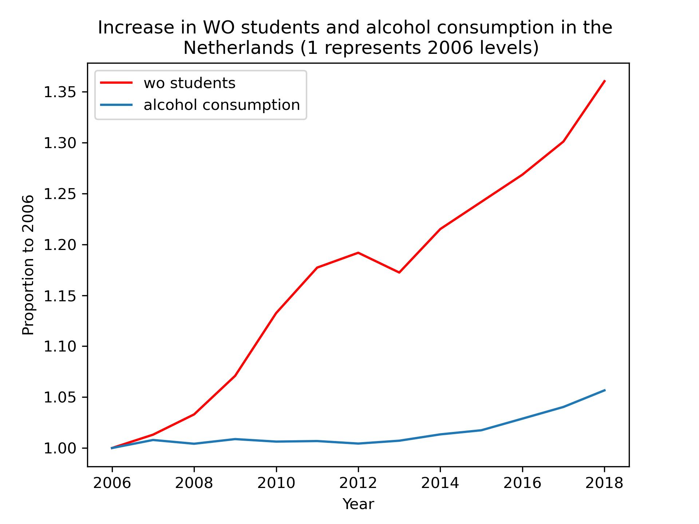

 Solutions for Computational Sciences Toolbox Assignment 

Here the titles: 
- **MCC Van Dyke et al., 2019**: 
Fantastic yeasts and where to find them: the hidden diversity of dimorphic fungal pathogens OR The Rise of Coccidioides: Forces Against the Dust Devil Unleashed
- **JT Harvey, Applied Ergonomics, 2002**: An analysis of the forces required to drag sheep over various surfaces.
- **DW Ziegler et al., 2005**: Correlation of continuous cardiac output measured by a pulmonary artery catheter versus impedance cardiography in ventilated patients

Here the plot: 

As we can see from the plot both the number of WO students and alcohol consumption has increased in the Netherlands during the time period between 2006 and 2018. Nonetheless, the number of students has increased by 35% while alcohol consumption has increased less than 5%. Most importantly, the plot has dpi=300. 
