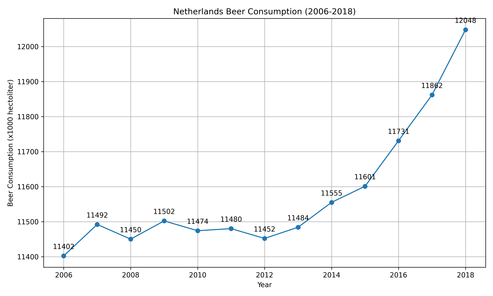

4. The title of the following papers pivotal to our knowledge:
* MCC Van Dyke et al., 2019\
Van Dyke, M. C. C., Teixeira, M. M., & Barker, B. M. (2019). Fantastic yeasts and where to find them: the hidden diversity of dimorphic fungal pathogens. Current opinion in microbiology, 52, 55-63.\
Van Dyke, M. C. C., Thompson 3rd, G. R., Galgiani, J. N., & Barker, B. M. (2019). The rise of Coccidioides: forces against the dust devil unleashed. Frontiers in immunology, 10, 2188.

* JT Harvey, Applied Ergonomics, 2002\
Harvey, J. T., Culvenor, J., Payne, W., Cowley, S., Lawrance, M., Stuart, D., & Williams, R. (2002). An analysis of the forces required to drag sheep over various surfaces. Applied ergonomics, 33(6), 523-531.

* DW Ziegler et al., 2005\
Ziegler, D. W., Lois, M., Hess, D., Pinilla, J., & Tellez, G. (2005). Correlation of continuous cardiac output measured by a pulmonary artery catheter versus impedance cardiography in ventilated patients. Chest, 128(4), 194S.

5. Create one plot from the dataset "istherecorrelation.csv".

    * The trend in the "WO" (WO [x1000]) data over time shows a clear upward trajectory. Initially, in 2006, it starts at a lower value and then steadily increases each year until 2018.

    * Between 2006 and 2012, beer consumption remained relatively steady, but from 2012 to 2018, there was a significant surge in beer consumption, starting at 11,452 hectoliters in 2012 and reaching 12,048 hectoliters in 2018.

    * The "WO" and "Consumption" curves exhibit a positive correlation over the specified time period. This positive correlation suggests that as the number of "WO" increases, there is a corresponding increase in beer consumption.

