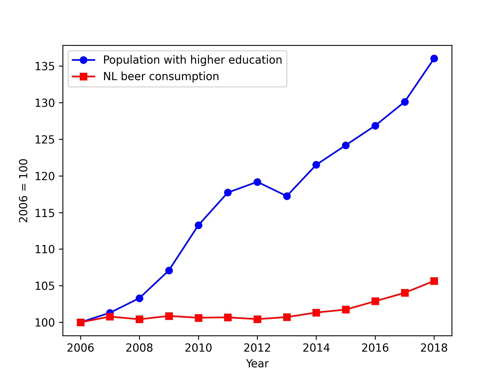

StudentID: 16473302

MCC Van Dyke et al., 2019
Fantastic yeasts and where to find them: the hidden diversity of dimorphic fungal pathogens

JT Harvey, Applied Ergonomics, 2002
An analysis of the forces required to drag sheep over various surfaces

DW Ziegler et al., 2005
The neurocognitive effects of alcohol on adolescents and college students

Normalising beer consumption in the Netherlands and the number of people with a higher education degree shows no obvious correlation or causation between the two graphs. This might be due to the fact that excessive beer consumption is broadly associated with students and not people that have already obtained their WO degree.