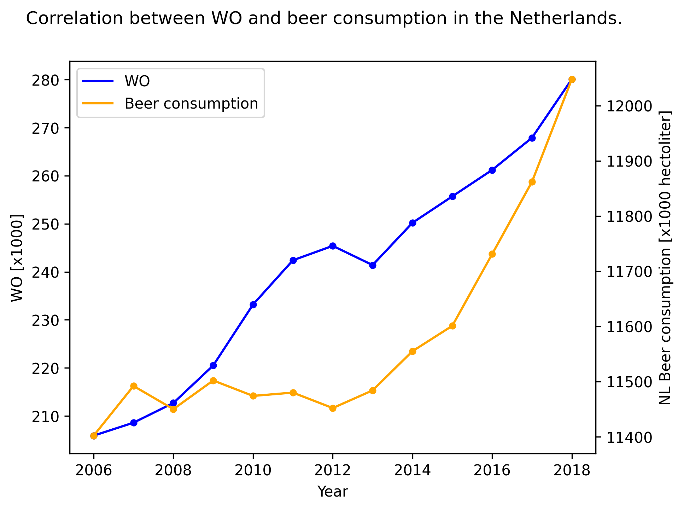

## Paper titles
- Fantastic yeasts and where to find them: the hidden diversity of dimorphic fungal pathogens
- An analysis of the forces required to drag sheep over various surfaces
- Correlation of continuous cardiac output measured by a pulmonary artery catheter versus impedance cardiography in ventilated patients

As you can see from the image above, beer consumption and the amound of WO students are clearly positively correlated. As the amount of WO students grows larger, so does the beer consumption. One note to make is that the y and x axes do not start at 0, so the correlation may look slightly more dramatic than it actually is in this image.
