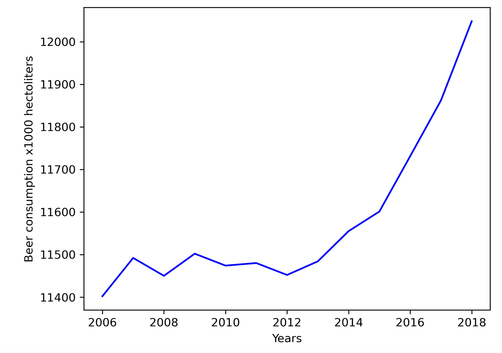

# Analysis of beer consumption in the Netherlands
##### -By Alexandros Du Preez

Below we have a plot showing the change in beer consumption in the Netherlands over time.

### Figure 1

~*Plot created using the Pandas package in Python*

From 2006 to 2012, beer consumption in the Netherlands was relatively constant. However, since 2012, it has increased at an increasing rate each year. 

