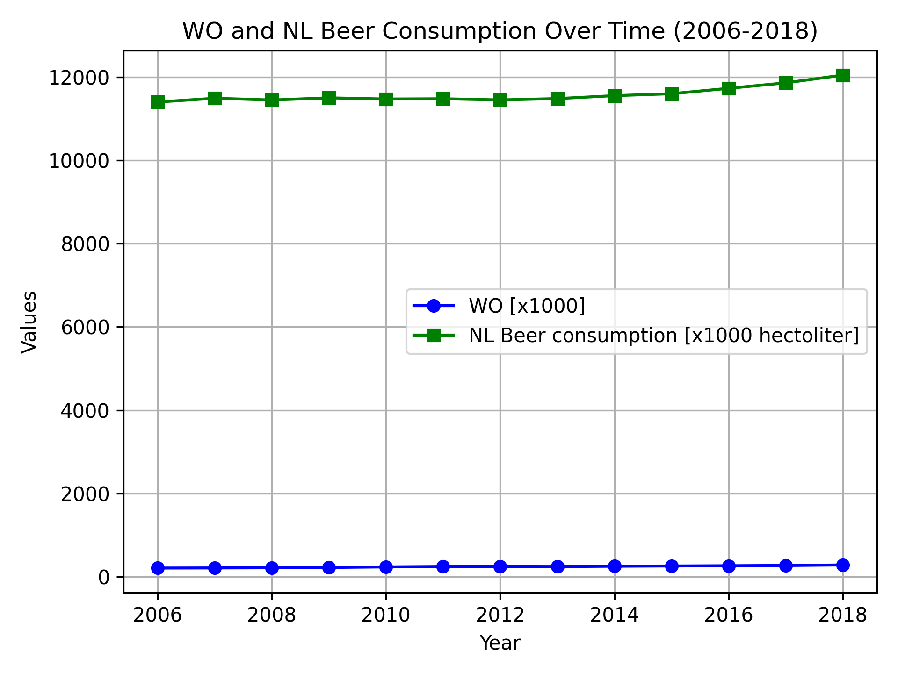

# 15370208
# MCC Van Dyke et al., 2019
# JT Harvey, Applied Ergonomics, 2002
# DW Ziegler et al., 2005

From the plot we can see that even though the WO(higher education population) is increasing steadily over the time period 2006-2018, the beer consumption in the Netherlands remains almost constant with very slight fluctuations. There appears to be no correlation between the rise in higher education and beer consumption during that time period. 
