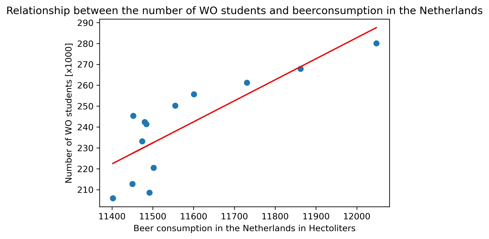

Fantastic yeasts and where to find them: the hidden diversity of dimorphic fungal pathogens

An analysis of the forces required to drag sheep over various surfaces

The neurocognitive effects of alcohol on adolescents and college students

Figure 1 shows the relationship between the number of WO students in the Netherlands (NL) and beer consumption in NL.
The blue dots show 12 individual datapoints from the year 2006 until 2018.The red line is the result of the regression analysis.
