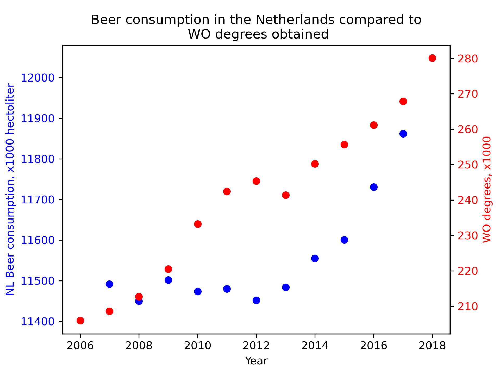

**Names of articles:**
- Fantastic yeasts and where to find them: the hidden diversity of dimorphic fungal pathogens
- An analysis of the forces required to drag sheep over various surfaces
- CORRELATION OF CONTINUOUS CARDIAC OUTPUT MEASURED BY A PULMONARY ARTERY CATHETER VERSUS IMPEDANCE CARDIOGRAPHY IN VENTILATED PATIENTS

**Plot:**

In the plot we see that there is a correlated upwards trend between beer consumption and WO degrees.
However, this does not prove causality.