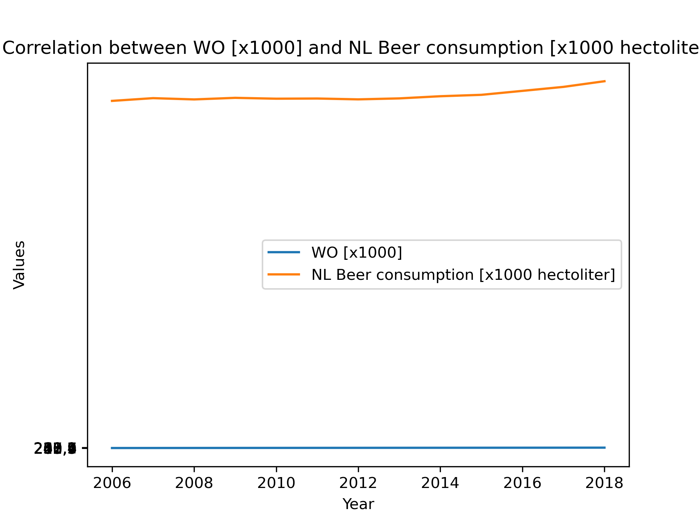

# Assignment Seminar Computational Science
## Papers
- Fantastic yeasts and where to find them: the hidden diversity of dimorphic fungal pathogens (MCC Van Dyke, MM Teixeira, BM Barker)
-  An analysis of the forces required to drag sheep over various surfaces (JT Harvey, J Culvenor, W Payne, S Cowley)
- Correlation of continuous cardiac output measured by a pulmonary artery catheter versus impedance cardiography in ventilated patients (DW Ziegler, M Lois, D Hess, J Pinilla, G Tellez)

## Beer Consumption

In the graph above the difference in beer consumption of the world vs The Netherlands is visible. The scales are different to get a better view for the possible presence of correlation. Up to about 2013 no large correlation is visible, after 2013 both the consumption in the world and in The Netherlands seem to grow exponentially. This can hint at a large correlation between the two.