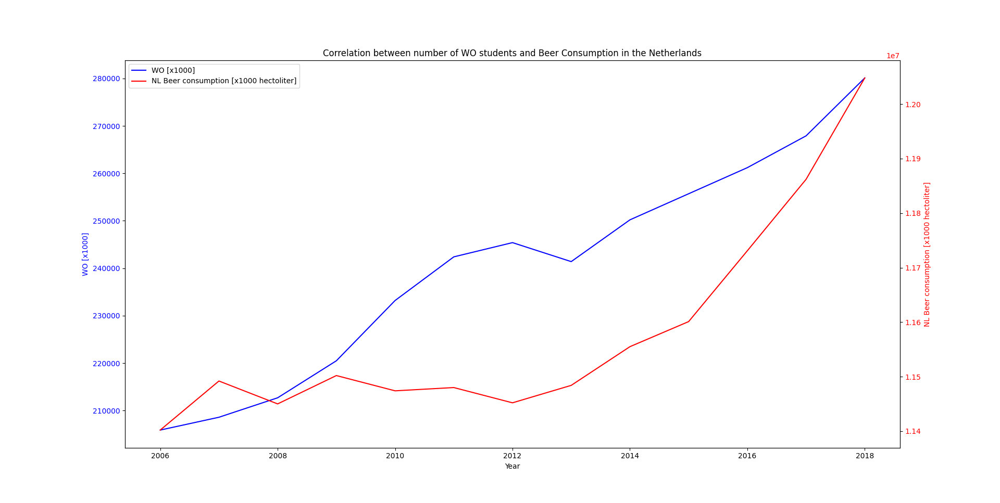

MCC Van Dyke et al., 2019
Fantastic yeasts and where to find them: the hidden diversity of dimorphic fungal pathogens

JT Harvey, Applied Ergonomics, 2002
An analysis of the forces required to drag sheep over various surfaces

DW Ziegler et al., 2005
The neurocognitive effects of alcohol on adolescents and college students

The plot visualizes the correlation between 'WO [x1000]' and 'NL Beer consumption [x1000 hectoliter]' for each year.
It seems that as 'WO [x1000]' increases, 'NL Beer consumption [x1000 hectoliter]' also tends to increase, especially from 2013 onwards.
This suggests a positive correlation. While a correlation exists, this does not directly imply causation, as other factors may contribute to the observed relationship.
