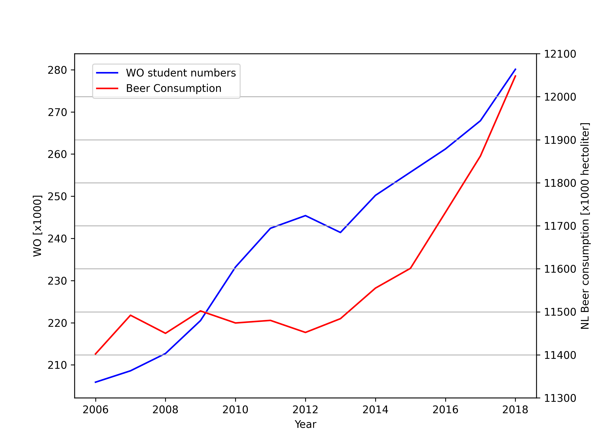

student id: 15304671

*Titles of our pivotal papers*

MCC Van Dyke et al., 2019: Fantastic yeasts and where to find them

JT Harvey, Applied Ergonomics, 2002: An analysis of the forces required to drag sheep over various surfaces

DW Ziegler et al., 2005: The neurocognitive effects of alcohol on adolescents and college students

*Figure 1: Number of Dutch university students and beer consumption over time.*

*Figure 2: Scatter plot showing the correlation between university students and beer consumption.*

These plots show the number of Dutch university students alongside beer consumption in the Netherlands. While both trends are generally increasing, there doesn’t appear to be a direct correlation between the two. For example, in 2009, the number of students increased, but beer consumption decreased. It's more likely that both trends are influenced by overall population growth, so there’s no clear evidence that the two factors are actually related. So more context would about the dataset would lead to a more accurate prediction.