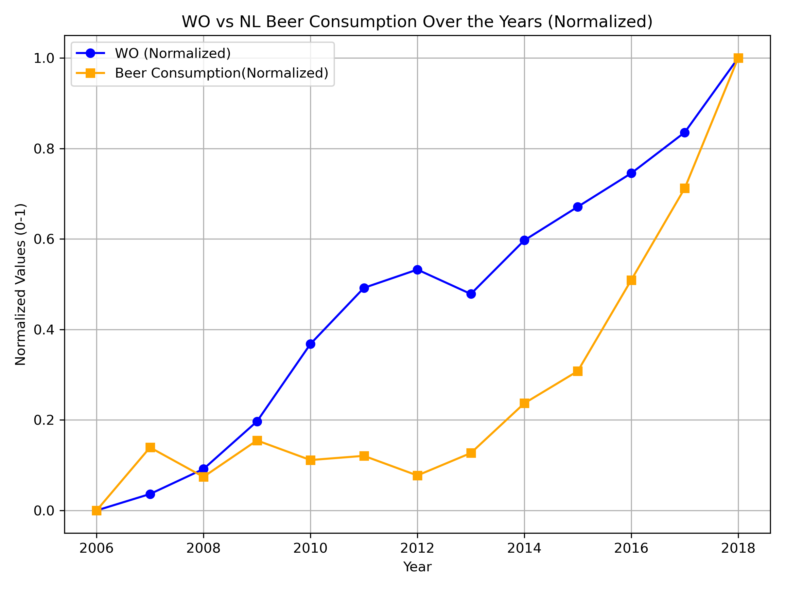

15546675

MCC Van Dyke et al., 2019

JT Harvey, Applied Ergonomics, 2002

DW Ziegler et al., 2005

The WO shows a consistent upward trend over the years. This indicates steady growth in student enrollment, especially from 2012 onwards, with a sharp increase in the final few years. 

Beer consumption fluctuates more in the early years, showing a decrease from 2006 to 2010, followed by a stable period. However, starting in 2014, there is a clear upward trend, which becomes more pronounced in the last few years, following WO enrollment more closely.

Hence, while WO enrollment steadily rises, beer consumption shows a delayed response with fluctuations. However, starting around 2014, the trends of both metrics begin to align more closely, both increasing at a similar rate towards the end. This sharp rise in both metrics after 2014 could indicate some connection between the growing student population and beer consumption, although correlation does not imply causation, and more factors should be considered.
