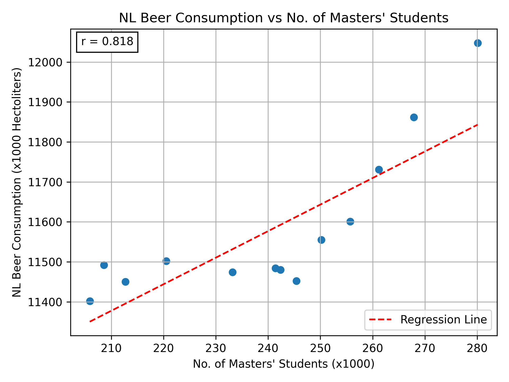

Student ID: 12736821

---

Paper Titles

- MCC Van Dyke et al., 2019: 
	- Van Dyke MCC, Teixeira MM, Barker BM et al. 2019 — Fantastic yeasts and where to find them: the hidden diversity of dimorphic fungal pathogens (Current Opinion in Microbiology, Dec 2019)
- JT Harvey, Applied Ergonomics, 2002:
	- JT Harvey, Applied Ergonomics, 2002 — An Analysis of the Forces Required to Drag Sheep over Various Surfaces (Applied Ergonomics, 2002)
- DW Ziegler et al., 2005:
	- DW Zeigler et al., 2005 — The Neurocognitive Effects of Alcohol on Adolescents and College Students (Preventive Medicine, 2005)

---

The plot shows significant positive correlation between the number of masters students and Netherlands beer consumption, with an r = 0.818. As usual, this does not imply causation, though it would be fun to imagine there is a causal effect.

