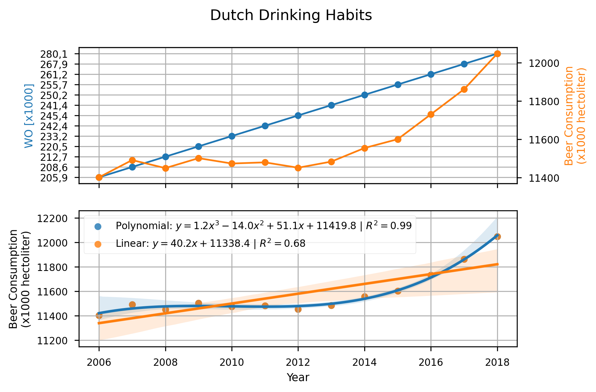

# Solutions

Papers pivotal to our knowledge:

* MCC Van Dyke et al., 2019
* JT Harvey, Applied Ergonomics, 2002
* DW Ziegler et al., 2005

Thirteen years of Dutch beer consumption and WO is shown. The top plot demonstrates strong, positive correlation between Dutch beer consumption and WO. While I am uncertain what WO is, qualitatively the correlation between the two fields is clear. Moreover, the bottom plot shows two different regressors fit to the Dutch beer consumption data. A linear *and* third order polynomial were fitted to the beer consumption data. While the fitted third order polynomial indicates a very strong fit, Pearson correlation coefficient $R^{2}=0.99$, such a correlation is certainly suspect and with such a small window of data, the polynomial regressor is likely overfit. The linear regressor, however, shows substantially weaker correlation, though still strong, positive correlation of $R^{2}=0.68$. The lower correlation of the beer consumption data is to be expected since the Dutch drinking habits appear to be non-linear. 95% confidence intervals are shown for the best fit lines to the data. In all cases, Dutch drinking habits appear to be increasing over time.
