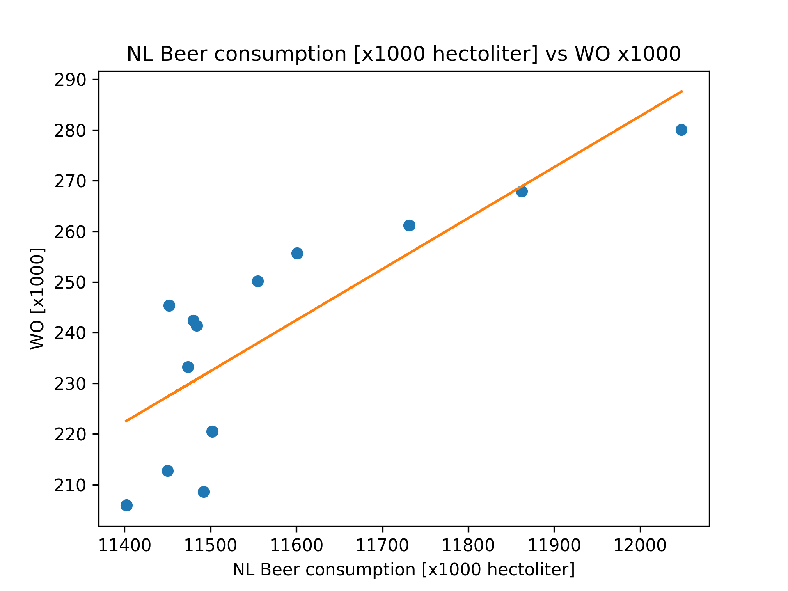

1. Fantastic yeasts and where to find them
2. An analysis of the forces required to drag sheep over various surfaces
3. The neurocognitive effects of alcohol on adolescents and college students 

The Pearson correlation coefficient equals 0.82 so the consumptions is strongly correlated.