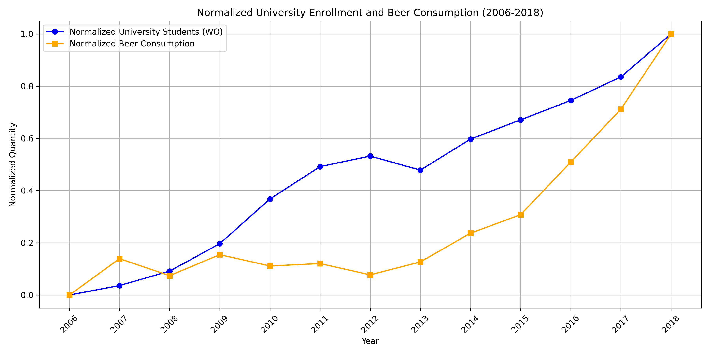

# Student ID
13444514

# Pivotal Papers
1. MCC Van Dyke et al., 2019
2. JT Harvey, Applied Ergonomics, 2002
3. DW Ziegler et al., 2005

# Data Visualization

## Interpretation
The plot shows the data of beerconsumption and the number of university students as a function of the year. The values are normalised so that the correlation of the data could be shown more clearly. 
The plot shows strong correlation between the amount of people attending university and the amount of beerconsumption per year. 
