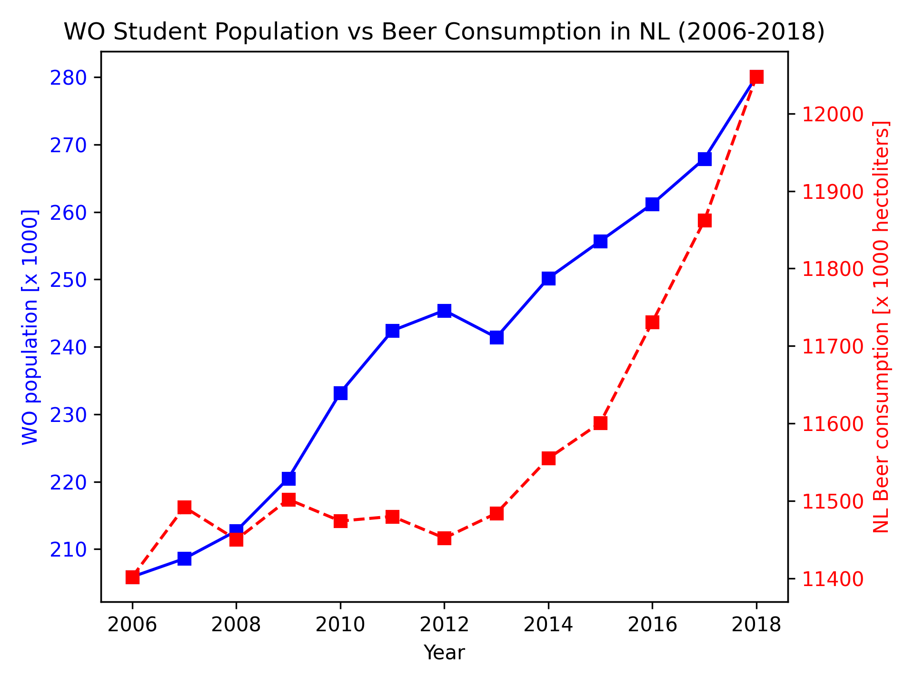

### Student Information
Name: Ernani Hazbolatow
UvA Studentnumber: 14272210 

### Title of Papers
* Fantastic yeasts and where to find them: the hidden diversity of dimorphic fungal pathogens
* An analysis of the forces required to drag sheep over various surfaces
* The neurocognitive effects of alcohol on adolescents and college students

### Data Analysis
The importance of the paper by Ziegler [1] is underscored by the rising prevalance of alcohol use in addition to the growing WO student population in the Netherlands. When both are plotted against each other, a correlation is observed between the two. However, the (mis)use of alcohol only appears to increase after 2013, whereas the WO student population has seen a constant increase, satrting before 2013. Therefore, although a correlation is present, it is not clear whether this rise of alcohol consumption can be explained by the increase in students or due to another cause.

[1] D. W. Zeigler et al., “The neurocognitive effects of alcohol on adolescents and college students,” Preventive Medicine, vol. 40, no. 1, pp. 23–32, Jan. 2005, doi: https://doi.org/10.1016/j.ypmed.2004.04.044.
‌
