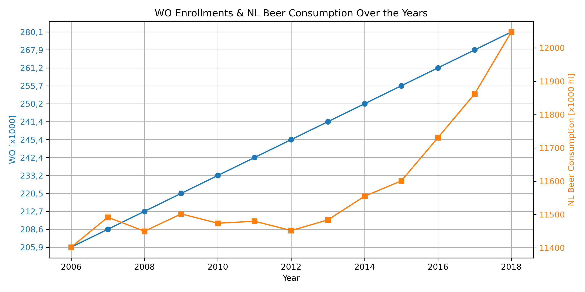

STUDENTID = 15761770

MCC Van Dyke et al., 2019
JT Harvey, Applied Ergonomics, 2002
DW Ziegler et al., 2005

The plot shows the trends in WO enrollments and NL beer consumption over the years from 2006 to 2018. Both datasets show an upward trend, indicating a general increase over time. The beer consumption exhibits a more pronounced rise from 2014 onwards, whereas the growth in WO enrollments is more linear and steady throughout the period. Without further in-depth analysis, it's not possible to conclude any direct relationship between these two variables.

