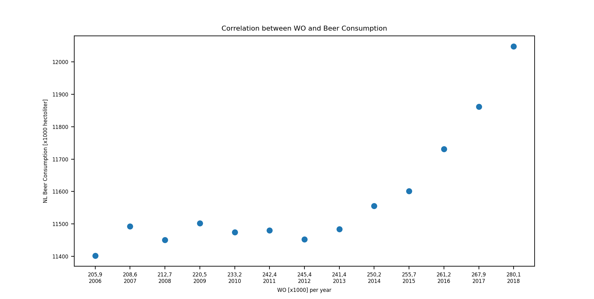

MCC Van Dyke et al., 2019
Fantastic yeasts and where to find them: the hidden diversity of dimorphic fungal pathogens

JT Harvey, Applied Ergonomics, 2002
An analysis of the forces required to drag sheep over various surfaces

DW Ziegler et al., 2005
The neurocognitive effects of alcohol on adolescents and college students

The plot visualizes the correlation between 'WO [x1000]' and 'NL Beer consumption [x1000 hectoliter]' for each year.

It seems that as 'WO [x1000]' increases, 'NL Beer consumption [x1000 hectoliter]' also tends to increase. 

The custom X-axis labels improve the readability of the plot by providing context for each data point, making it easier to identify trends and outliers.

Overall, this plot provides a valuable visual representation of the data, allowing for a preliminary assessment of the correlation between wine production and beer consumption in the Netherlands over time. Further statistical analysis and domain-specific knowledge can help uncover the underlying factors and implications of this relationship.
