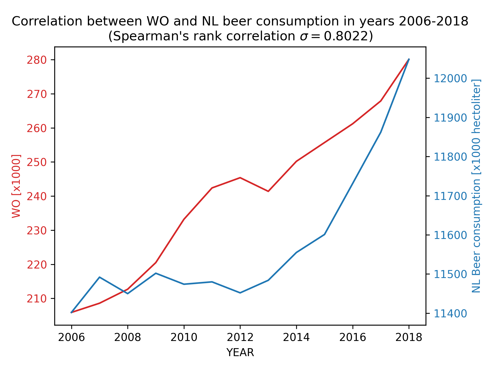

##### MCC Van Dyke et al., 2019

* *"Fantastic yeasts and where to find them: the hidden diversity of dimorphic fungal pathogens"*
* *"The Rise of Coccidioides: Forces Against the Dust Devil Unleashed"*
  
##### JT Harvey, Applied Ergonomics, 2002

* *"An analysis of the forces required to drag sheep over various surfaces"*
  
##### DW Ziegler et al., 2005

* *"Correlation of continuous cardiac output measured by a pulmonary artery catheter versus impedance cardiography in ventilated patients"*

On the x-axis: years from 2006 to 2018 including. 

On the y-axis: WO plotted in red, beer consumption plotted in blue.

Data points were joined using a line plot (instead of a scatter plot) to visualize the trend. Based on both the visualization and the calculation of Spearman's rank correlation $\sigma = 0.8022$ we can say that there is indeed a positive correlation between WO and NL beer consumption - a strong one, although not a perfect one.