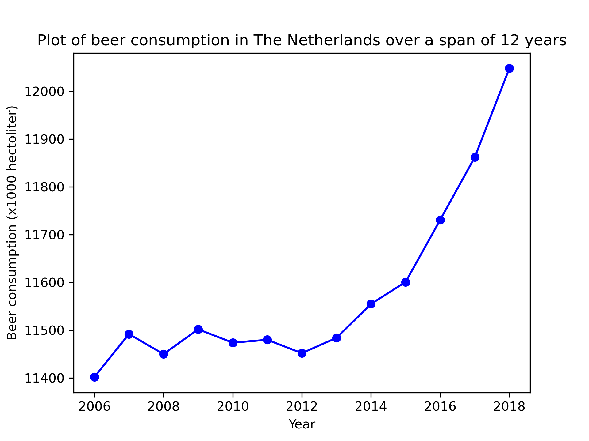

## Student ID
15762467

## Papers
MCC Van Dyke et al., 2019
JT Harvey, Applied Ergonomics, 2002
DW Ziegler et al., 2005

## Plot
The following plot shows a visualization of beer consumption in The Netherlands over a span of 12 years: from 2006 till 2018. In this plot it is visible that there is an upward trend starting from 2006, and from 2012 the beer consumption increases significanty.

