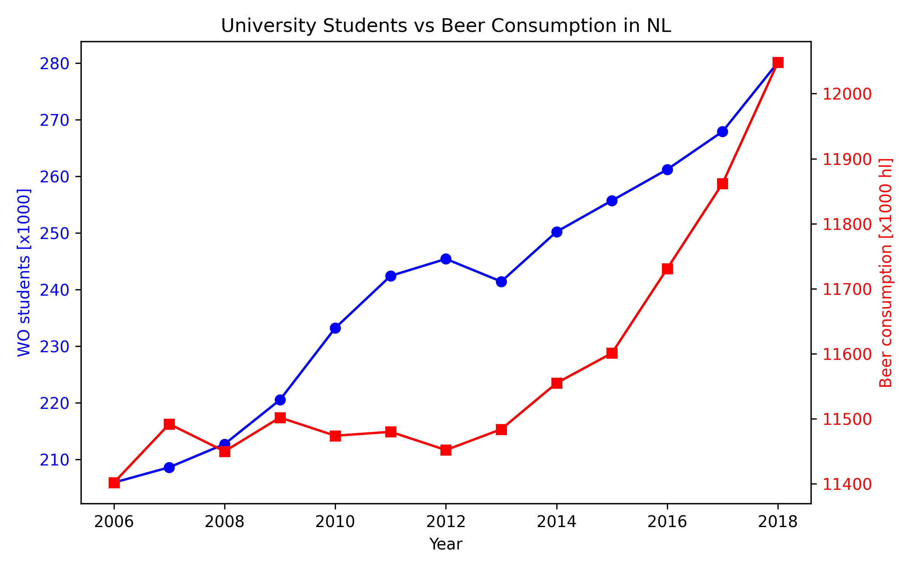

## Student ID: 13965751

---

## Titles of important papers:
- *Fantastic yeasts and where to find them: the hidden diversity of dimorphic fungal pathogens* (MCC Van Dyke et al., 2019)
- *An analysis of the forces required to drag sheep over various surfaces* (JT Harvey, Applied Ergonomics, 2002)
- *The neurocognitive effects of alcohol on adolescents and college students* (DW Ziegler et al., 2005)

---

## Visualization of University Students and Beer Consumption in the Netherlands

This plot shows the number of university students (WO) and national beer consumption in the Netherlands from 2006 to 2018.  

The figure shows that the number of students steadily increased, while the beer consumption remained relatively stable with a slight upward trend.  
This suggests that the correlation between students and beer consumption may be coincidental rather than causal.

