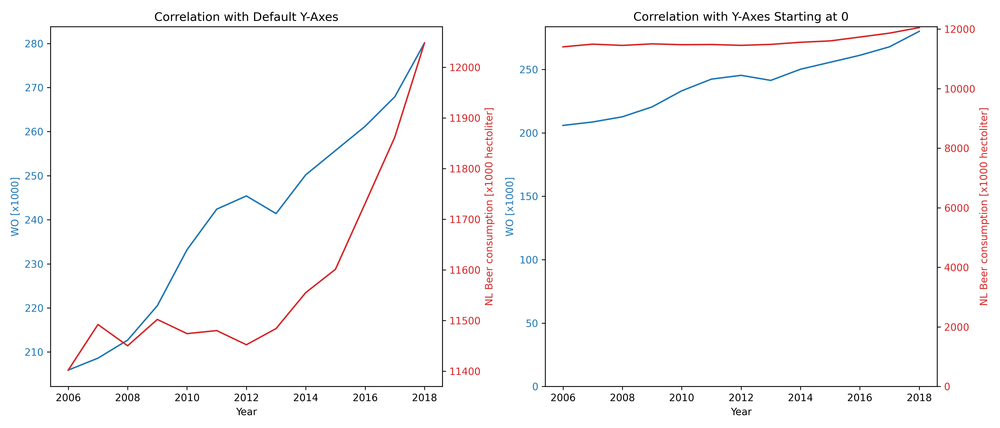

Marcello Driel
StudentID: 15385337
* MCC Van Dyke et al., 2019: Fantastic yeasts and where to find them: the hidden diversity of dimorphic fungal pathogens
* JT Harvey, Applied Ergonomics, 2002: An analysis of the forces required to drag sheep over various surfaces
* DW Ziegler et al., 2005: The neurocognitive effects of alcohol on adolescents and college students

From this plot at first sight it seems like the 2 variables are correlated through time. However when the automatic Y-axis scaling is disabled, it becomes clear that they actually share no correlation. At best, it can be said that the amount of beer consumed in the Netherlands trends in the same direction as 'WO'.
