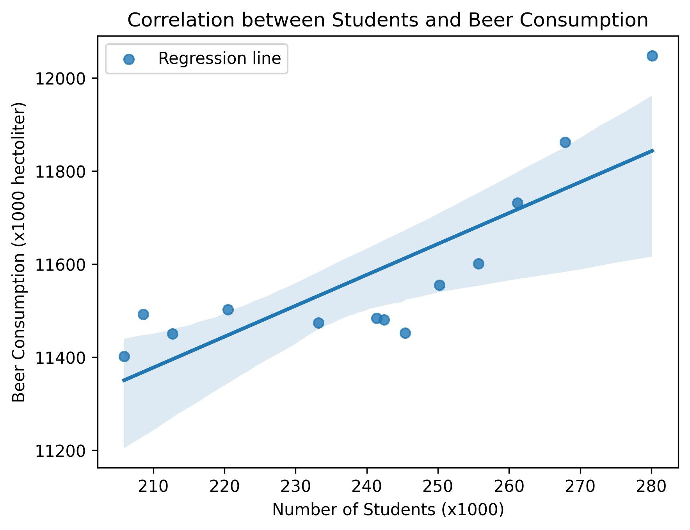

# Student number: 16393929

## Important papers:
1. *Fantastic yeasts and where to find them: the hidden diversity of dimorphic fungal pathogens*
2. *An analysis of the forces required to drag sheep over various surfaces*
3. There is no paper by a D.W. Ziegler, emphasis on the **ie** in 2005. There is a paper called 
"*The neurocognitive effects of alcohol on adolescents and college students*" by a D.W. Z**ei**gler,
and one called "*Cortisol changes among patients with septic shock and the relationship to ICU and hospital stay*"
by a D.W. Ziegler who only signed as D. Ziegler.

## Is there correlation?

By plotting beer consumption in the Netherlands against the number of WO level students we see a linear~ish relationship. A regression line has also been added. From the number of data we have it is hard to tell if there is a correlation, althoug there is evidence for it. The bigger question is whether the two are causated or not, i.e. is the larger beer consumption caused by the larger number of students in a given year? Or vise versa?
