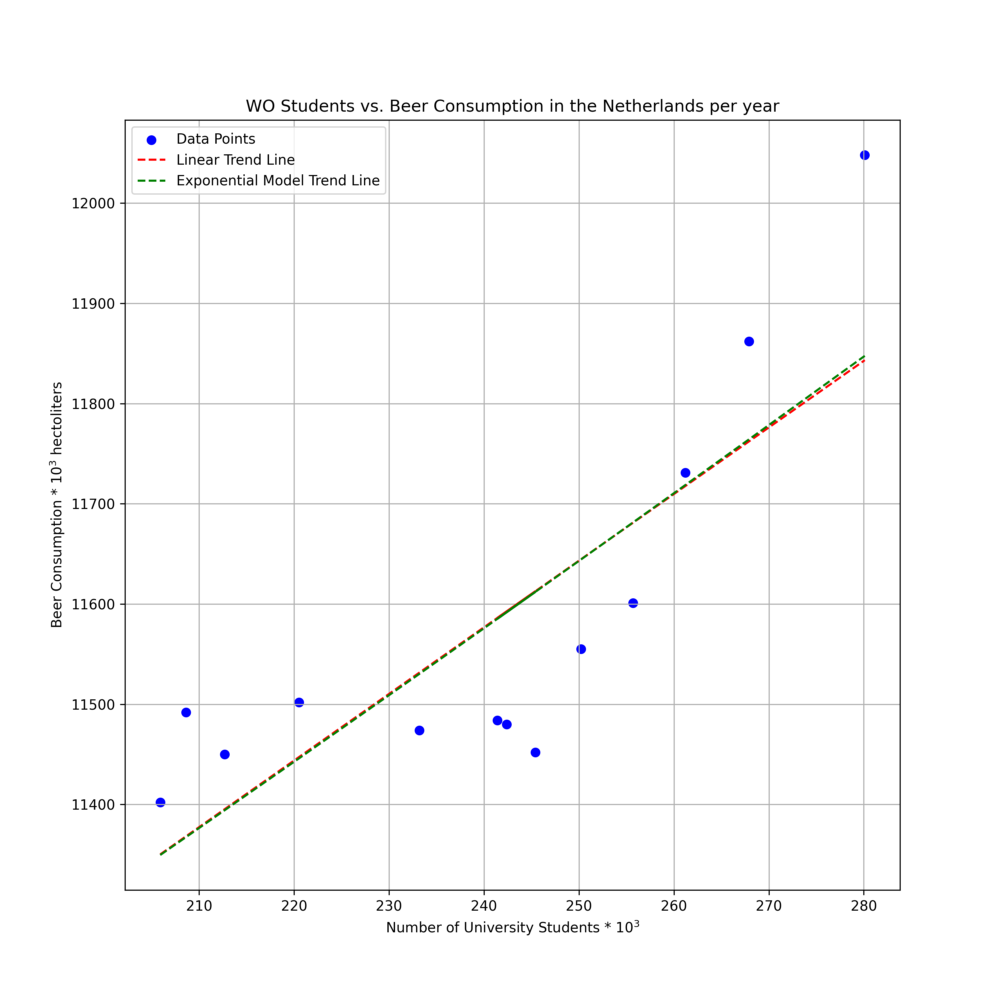

Student ID: 15717879  

Titles:  
- Fantastic yeasts and where to find them: the hidden diversity of dimorphic fungal pathogens
- An analysis of the forces required to drag sheep over various surfaces
- The neurocognitive effects of alcohol on adolescents and college students

The above figure plots the number of WO students on the x-axis, against the number of hectoliters of beer
consumed in the Netherlands on the y-axis, with each point on the scatter plot representing a year.  
A linear trend line has been plotted to evaluate the data for a linear trend. The data was also fitted to
an exponential growth model. Both yielded the same line, which would indicate that the number of liters of
beer consumed in the Netherlands per year increases linearly with the number of university students.