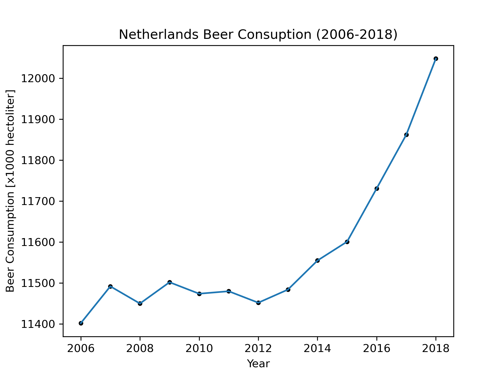

# Titles

- ‘Fantastic Yeasts and Where to Find Them: The Hidden Diversity of Dimorphic Fungal Pathogens’

- ‘An Analysis of the Forces Required to Drag Sheep over Various Surfaces’

- ‘Correlation of Continuous Cardiac Output Measured by a Pulmonary Artery Catheter Versus Impedance Cardiography in Ventilated Patients’
  
# Data Plot and Interpretation

