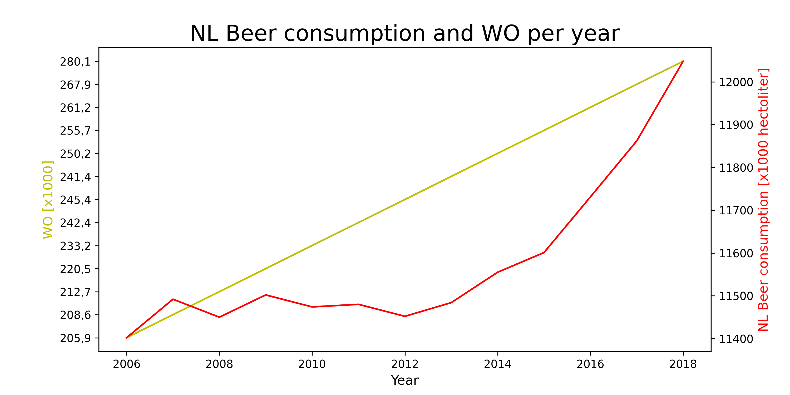

## Titles of the three papers given to gain pivotal knowledge:

Fantastic yeasts and where to find them: the hidden diversity of dimorphic fungal pathogens 

An analysis of the forces required to drag sheep over various surfaces

Correlation of continuous cardiac output measured by a pulmonary artery catheter versus impedance cardiography in ventilated patients

## Figure showing the beer consumption in the Netherlands between 2008-2016

