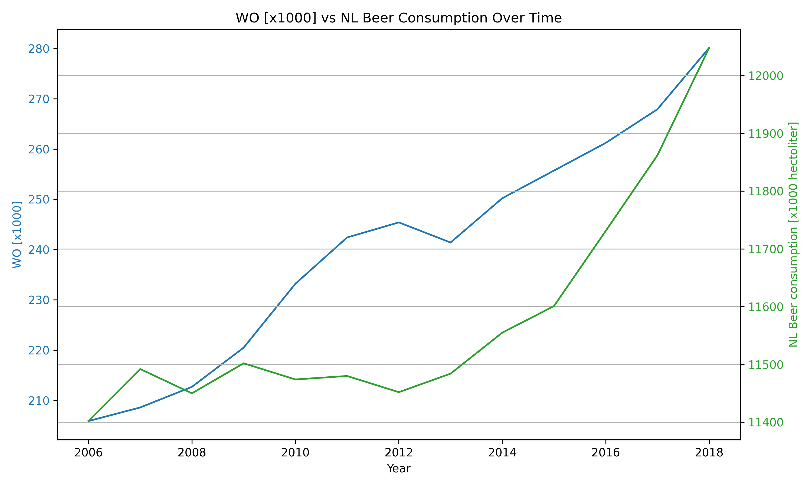

# Data Analysis Report

**Student ID:**  
*14016273*

**Full Name:**  
*Fabian Ivulic*

## References

1. **Fantastic yeasts and where to find them: the hidden diversity of dimorphic fungal pathogens** (MCC Van Dyke et al., 2019)
2. **An analysis of the forces required to drag sheep over various surfaces** (JT Harvey, Applied Ergonomics, 2002)
3. **The neurocognitive effects of alcohol on adolescents and college students** (DW Ziegler et al., 2005)

## Data Interpretation

The plot shows a comparison between the WO (university-level education completions in thousands) and Dutch beer consumption (in hectoliters) over the years from 2006 to 2018.

- **WO (university education completions)** shows a consistent upward trend over the years, indicating an increase in higher education participation.
- **Beer consumption** fluctuates slightly but remains relatively stable, with a minor upward trend in later years.
- Despite both variables increasing, their growth patterns suggest they may not be directly correlated.

This highlights the increasing educational attainment in the Netherlands while beer consumption remained somewhat steady.

## Plot

